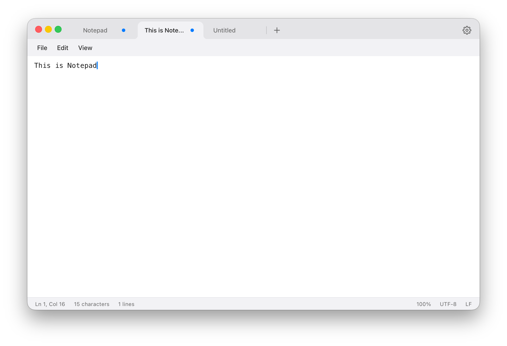
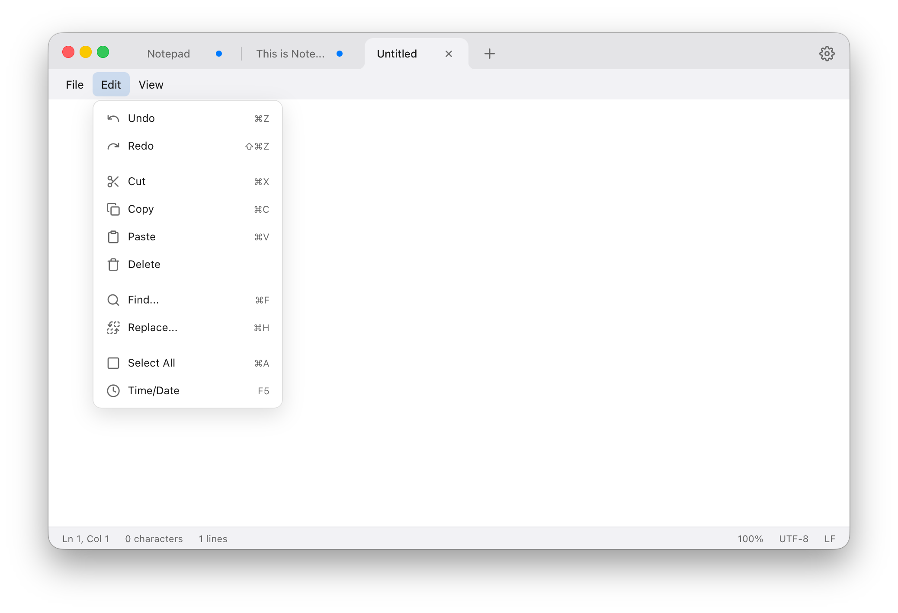
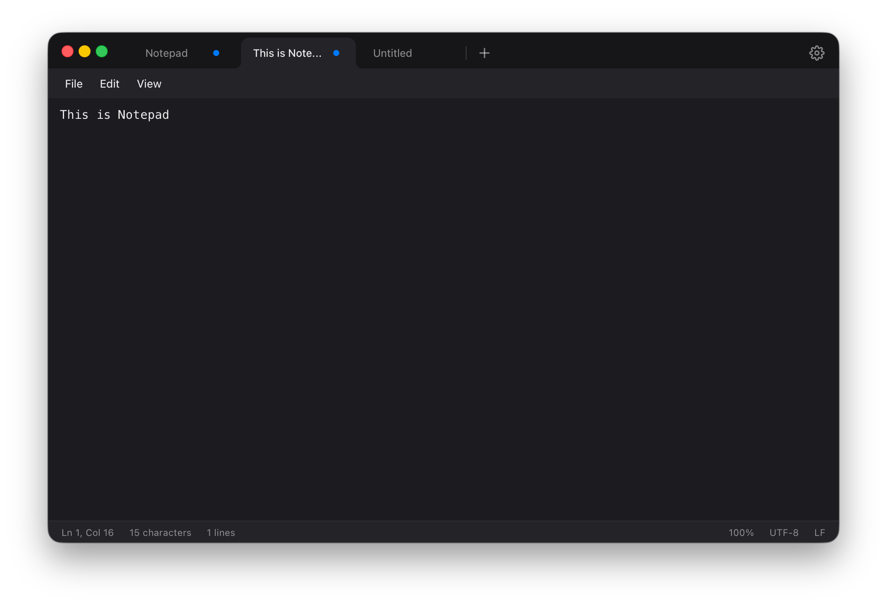
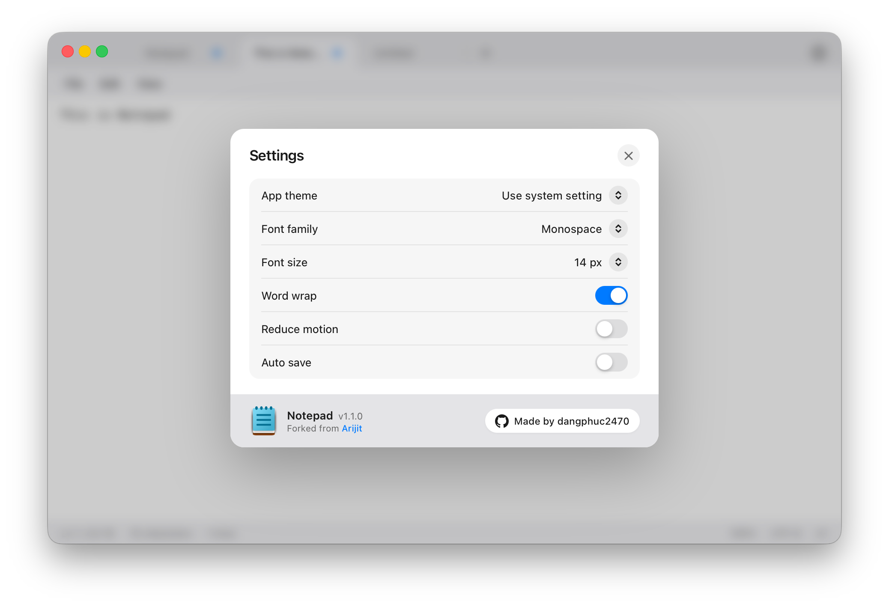

# Notepad for macOS

A modern, fast, and authentic Windows 11 Notepad recreation crafted for macOS. Built with Tauri v2, Rust, and React, featuring native macOS window integration, Fluent Design aesthetics, multi-window tab workflows, and instant startup.

<div align="center">
  
</div>

<p align="center">
  <a href="https://github.com/dangphuc2470/notepad/releases/download/v1.1.1/Notepad_1.1.1_aarch64.dmg"></a>
  <a href="https://github.com/dangphuc2470/notepad/releases/download/v1.1.1/Notepad_1.1.1_x64.dmg"></a>
</p>

<p align="center">
  
  
  
  
  
</p>

> **Note for macOS Gatekeeper (First Launch)**:
> Since this app is open-source and not signed with an Apple Developer certificate, macOS may flag it on first download. Run this command in **Terminal** to bypass Gatekeeper:
> ```bash
> xattr -cr /Applications/Notepad.app
> ```

---

## Features

- **Blazing Fast and Lightweight**: Powered by Rust backend and native macOS WebKit (< 15MB app size, ~35MB RAM).
- **Authentic Windows 11 Fluent Design**:
  - Seamless 3-layer Fluent contrast (Titlebar &rarr; MenuBar &rarr; Editor canvas).
  - Chrome / Edge-style concave bottom tab curves.
  - Native macOS 26 window squircle, hairline insets, and centered Traffic Light integration.
- **Multi-Window & Fluid Tab Workflows**:
  - **Detach Tab**: Drag any tab outside or press `⇧⌘N` to spawn a new independent window.
  - **Cross-Window Tab Merging**: Drag tabs seamlessly across separate windows with live ghost window preview, magnetic hit testing, and smooth collapse/expand slot animations.
  - **Reorder Tabs**: Fluid FLIP-animated horizontal tab swapping.
  - **Reopen Closed Tabs**: `⇧⌘T` history stack supporting up to 30 recently closed tabs.
- **Native macOS AppKit Transitions**:
  - **Ultra-Snappy 100ms Reveal & Exit**: Pure AppKit `NSAnimationContext` window fade animations without traffic lights flicker or initial frame jumps.
  - **Dynamic System Accent Color**: Real-time event-driven listener (`CFNotificationCenter` + `NSColor.controlAccentColor`) updating the UI when macOS accent color changes (0% CPU, 0 polling).
- **Smart Auto Save & Data Protection**:
  - Configurable debounced background auto-save.
  - Instant auto-save flush on window blur.
  - Native AppKit sequential `NSAlert` modal save protection when closing unsaved tabs.
- **Native File Associations & Finder Integration**:
  - Support for `.txt`, `.md`, `.log`, `.json`, `.csv`, `.toml`, `.yaml`, `.py`, `.rs`, `.ts`, `.cpp`, `.html`, `.css`, and more.
  - Double-click files in Finder or right-click **Open With &rarr; Notepad** to open immediately without an empty "Untitled" flash.
- **Accessibility & Reduce Motion**:
  - Full Reduce Motion toggle in Settings (`0ms` instant window and tab transitions, disabling blur filters).
- **Dark and Light Modes**: Dynamic theme support syncing with macOS appearance or customizable in Settings.
- **macOS 26 Settings Panel**: Clean grouped card settings for Font, Size, Theme, Auto Save, and Reduce Motion.

---

## Screenshots

<div align="center">
  <h3>Light Mode</h3>
  
  <br /><br />
  <h3>Menu Bar</h3>
  
  <br /><br />
  <h3>Dark Mode</h3>
  
  <br /><br />
  <h3>Settings Panel</h3>
  
</div>

---

## Keyboard Shortcuts

| Action | Shortcut |
| :--- | :--- |
| **New Tab** | `Cmd + T` or `Cmd + N` |
| **Reopen Closed Tab** | `Shift + Cmd + T` |
| **New Window (Detach)** | `Shift + Cmd + N` |
| **Switch to Tab 1–8** | `Cmd + 1` ... `Cmd + 8` |
| **Switch to Last Tab** | `Cmd + 9` |
| **Close Tab / Window** | `Cmd + W` |
| **Open File** | `Cmd + O` |
| **Save** | `Cmd + S` |
| **Save As** | `Shift + Cmd + S` |
| **Find** | `Cmd + F` |
| **Replace** | `Cmd + H` |
| **Zoom In / Out / Reset** | `Cmd + +` / `Cmd + -` / `Cmd + 0` |
| **Insert Date / Time** | `F5` |
| **Settings** | `Cmd + ,` |

---

## Getting Started

### Prerequisites

- **Node.js**: v18+ (`npm` or `pnpm`)
- **Rust**: `rustc` & `cargo` installed via [rustup](https://rustup.rs/)

### Development

```bash
# Clone the repository
git clone https://github.com/dangphuc2470/notepad.git
cd notepad

# Install dependencies
npm install

# Run in development mode with Hot Reload
npx @tauri-apps/cli dev
```

### Build Production Bundle

```bash
# Build standalone .app and .dmg installer for personal use
./build_personal.sh
```

---

## Acknowledgements and Credits

- Forked and enhanced from [Arijit-gotsomecodes/NotePadMac](https://github.com/Arijit-gotsomecodes/NotePadMac).
- Officially featured under **Good Forks** on upstream's repository.
- Designed, modernized, and maintained with care by [dangphuc2470](https://github.com/dangphuc2470).

---

## License and Disclaimer

- Distributed under the **MIT License**.
- *Disclaimer: This is an independent open-source recreation created for educational and personal utility purposes. It is not affiliated with, sponsored, or endorsed by Microsoft Corporation.*
